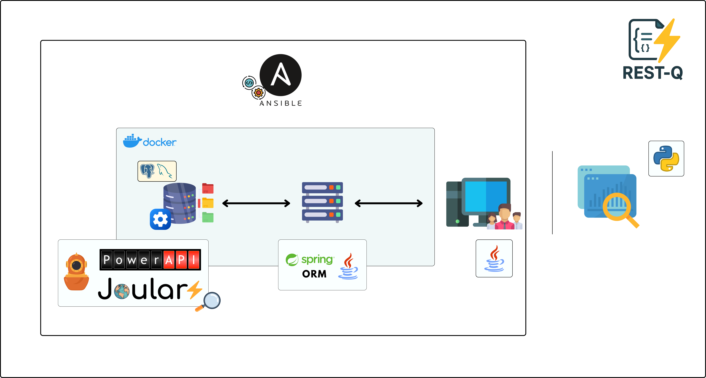

# RESTQ - Web Applications Benchmarking and Energy Monitoring Framework

RESTQ is a comprehensive framework for benchmarking web applications and monitoring their energy consumption. It provides automated tools for performance testing, energy analysis, and result visualization across different database systems and configurations.

## 🚀 Features

- **Energy Monitoring**: Real-time energy consumption tracking using PowerAPI, Scaphandre and PowerJoular.
- **Benchmarking with TPC Standards**: Support for TPC-C and TPC-H implementations to evaluate performance under realistic workloads.
- **REST API**: HTTP API for remote benchmark execution and monitoring
- **Ansible Automation**: Automated deployment and configuration management
- **Visualization**: Interactive dashboards for benchmark results and energy metrics
- **Multi-Database Support**: Currently supports PostgreSQL; integration with additional DBMSs is underway.

## 📋 Prerequisites

- Java 23 or higher
- Python 3.9 or higher
- Docker and Docker Compose
- Maven 3.6 or higher
- Ansible (for automated deployment)

## 🛠️ Installation

For detailed installation instructions, see our [Installation Guide](docs/getting-started/installation.md).

## 🏗️ Architecture

## 🤝 Contributing

We welcome contributions! If you have any suggestion do not hesitate to open Issue or PR.

## 🔗 Acknowledgments

- [BenchBase](https://github.com/cmu-db/benchbase) - Database benchmarking framework
- [PowerAPI](https://github.com/powerapi-ng/powerapi) - Energy monitoring toolkit
- [Ansible](https://www.ansible.com/) - Automation platform
