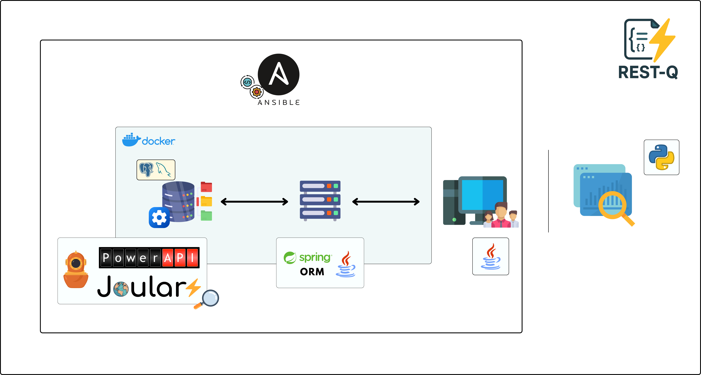

# RESTQ: Database Benchmarking and Energy Monitoring Framework

Welcome to the **RESTQ** documentation! RESTQ is a comprehensive framework for web applications benchmarking with integrated energy monitoring capabilities.

## What is RESTQ?

RESTQ combines several powerful tools to provide a complete solution for web sites energy consumption and performance analysis:

- **Database fullfilment with data**: Uses [BenchBase](https://github.com/cmu-db/benchbase), or our prepared datasets.
- **Energy Monitoring**: Real-time energy consumption tracking using PowerAPI and other monitoring tools
- **REST API**: HTTP-based interface for remote benchmark execution and control
- **Visualization**: Interactive tools for analyzing benchmark results and energy consumption patterns
- **Automation**: Ansible-based deployment and management across multiple nodes

## Key Features

### 📊 Comprehensive Benchmarks
- TPC-C and TPC-H
- Custom benchmark workloads
- Variable load patterns and mixtures

### ⚡ Energy Monitoring
- Real-time power consumption tracking
- Container-level energy attribution
- Integration with PowerAPI, Scaphandre and PowerJoular (In progress)

### 🔧 Easy Deployment
- Docker containerization
- Ansible automation
- Multi-node cluster support

### 📈 Rich Visualization
- Interactive plots and charts
- Energy consumption analysis
- Performance correlation views

## Architecture Overview

## Quick Start

Get started with RESTQ in just a few steps:

1. **[Install Prerequisites](getting-started/installation.md)** - Set up Java, Docker, and other dependencies
2. **[Configuration](getting-started/configuration.md)** - Customize benchmarks and monitoring

## Project Status

RESTQ is actively developed and maintained (some of the feautres are added with new updates). The framework is built on proven technologies:

- **BenchBase**: Industry-standard database benchmarking tool
- **Spring Boot**: Enterprise-grade REST API framework
- **Docker**: Containerization for reproducible deployments

---

*Ready to get started? Head over to the [Installation Guide](getting-started/installation.md) to set up your first rest-q environment!* 
